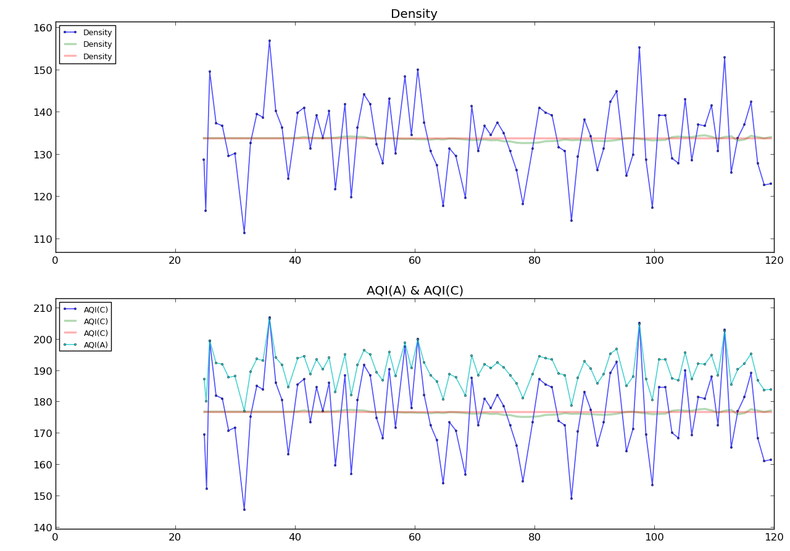

MSP430_Launchpad_AQI
==================
使用GP2Y1010AU测量PM2.5,通过9600的uart发送至电脑

效果:

----

MSP430_Launchpad_AQI
==================
MSP430 Launchpad AQI measurer via SHARP_GP2Y1010AU, send to computer via uart@9600
Using old msp430 lib....

Effect:

----

